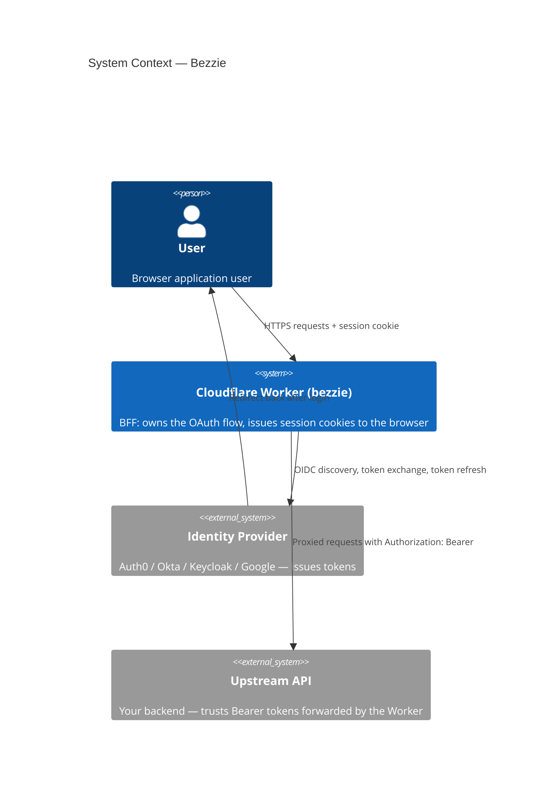
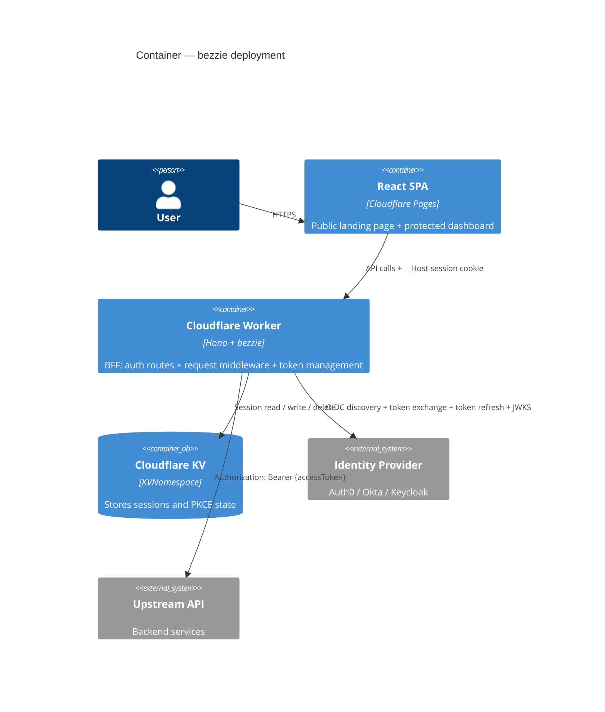

# Bezzie

**Bezzie** — your BFF's BFF. Handles the Backend for Frontend OAuth pattern so you don't have to.

[](https://www.npmjs.com/package/bezzie)

A BFF (Backend for Frontend) OAuth 2.0 auth library for Cloudflare Workers.

Implements the [OAuth 2.0 for Browser-Based Apps (BCP212)](https://datatracker.ietf.org/doc/html/draft-ietf-oauth-browser-based-apps) pattern — JWTs never touch the browser. The BFF owns the OAuth flow and issues a session cookie to the frontend instead.

```
npm install bezzie
```

## Get started in 5 minutes

**1. Install:**
```sh
npm install bezzie
```

**2. Add a KV namespace to `wrangler.toml`:**
```toml
[[kv_namespaces]]
binding = "SESSION_KV"
id = "<your-kv-namespace-id>"
```

**3. Add your client secret:**
```sh
wrangler secret put AUTH0_CLIENT_SECRET
```

**4. Wire it up:**
```typescript
import { createBezzie, providers, cloudflareKV } from 'bezzie'

const auth = createBezzie({
  ...providers.auth0('your-tenant.auth0.com'),
  clientId: 'xxx',
  clientSecret: env.AUTH0_CLIENT_SECRET,
  adapter: cloudflareKV(env.SESSION_KV),
  baseUrl: 'https://app.yourproject.com',
})

app.route('/auth', auth.routes())
app.use('/api/*', auth.middleware())
```

**5. Protect a route:**
```typescript
app.get('/api/me', (c) => c.json(c.var.user))
```

Done. Your app now has BCP212-compliant BFF auth.

---

## Demo

See the full BFF flow in action: [bezzie-demo.neilmason.dev](https://bezzie-demo.neilmason.dev)

Source: [github.com/neilpmas/bezzie-demo](https://github.com/neilpmas/bezzie-demo)

---

## Why

Most OAuth libraries hand tokens directly to the browser. BCP212 says you shouldn't — it's a significant attack surface. Bezzie keeps tokens server-side in Cloudflare KV and gives the browser a session cookie instead.

There's no open source library for this specific combination (BFF OAuth on Cloudflare Workers). The closest alternatives are Duende BFF (.NET) and `@auth0/nextjs-auth0` — both tied to specific frameworks.

---

## Usage

```typescript
import { createBezzie, providers, cloudflareKV } from 'bezzie'

const auth = createBezzie({
  ...providers.auth0('your-tenant.auth0.com'),
  clientId: 'xxx',
  clientSecret: env.AUTH0_CLIENT_SECRET,
  audience: 'https://api.yourproject.com',
  adapter: cloudflareKV(env.SESSION_KV),
  baseUrl: 'https://app.yourproject.com',
})

// Mount auth routes
app.route('/auth', auth.routes())

// Protect API routes
app.use('/api/*', auth.middleware())
```

This gives you:

| Route | Description |
|---|---|
| `GET /auth/login` | Redirects to provider, initiates Authorization Code + PKCE flow. Supports `returnTo` query param for post-login redirect. |
| `GET /auth/callback` | Exchanges code for tokens, stores session in KV, sets cookie. |
| `POST /auth/logout` | Clears session, clears cookie, redirects to provider logout. |

---

## Accessing User Identity

After `auth.middleware()`, downstream handlers can access the user identity and the current access token via `c.var`:

```typescript
app.get('/api/me', (c) => {
  const user = c.var.user
  const token = c.var.accessToken
  return c.json({ user })
})
```

## Forwarding Upstream

The `accessToken` on the context is intended for the app to forward to an upstream service (e.g., a Spring Boot API or any other microservice), since Bezzie doesn't mutate request headers directly.

```typescript
app.all('/api/proxy/*', async (c) => {
  const url = new URL(c.req.url)
  const target = `https://api.upstream.com${url.pathname}${url.search}`
  
  return fetch(target, {
    method: c.req.method,
    headers: {
      ...c.req.header(),
      'Authorization': `Bearer ${c.var.accessToken}`
    },
    body: c.req.raw.body
  })
})
```

---

## How It Works

### System context



### Containers



### Per-request flow

1. Browser sends request to BFF with session cookie
2. BFF looks up session in KV, retrieves access token
3. BFF validates JWT (via JWKS, using Web Crypto API)
4. If expired, BFF uses refresh token to get a new one and updates KV
5. BFF forwards request upstream with `Authorization: Bearer <token>`

---

## Adapters

Bezzie supports multiple session storage backends:

### Cloudflare KV
Recommended for production on Cloudflare Workers.
```typescript
import { cloudflareKV } from 'bezzie'
// ...
adapter: cloudflareKV(env.SESSION_KV)
```

### Redis (Upstash)
Good for cross-region session consistency.
```typescript
import { RedisAdapter } from 'bezzie'
// ...
adapter: new RedisAdapter({ url: env.REDIS_URL, token: env.REDIS_TOKEN })
```

### Memory
Useful for local development and testing. Do not use in production.
```typescript
import { MemoryAdapter } from 'bezzie'
// ...
adapter: new MemoryAdapter()
```

---

## Configuration

| Option | Type | Description |
|---|---|---|
| `issuer` | `string` | Your OIDC provider issuer URL (e.g. `https://tenant.auth0.com`) |
| `clientId` | `string` | OAuth client ID |
| `clientSecret` | `string` | OAuth client secret — keep in Workers secrets |
| `audience` | `string` | API audience identifier |
| `adapter` | `SessionAdapter` | Session adapter (e.g. `cloudflareKV(env.SESSION_KV)`) |
| `baseUrl` | `string` | Base URL of your application (used for callback and redirects) |
| `providerHints` | `object` | Optional tweaks for specific providers (`logoutUrl`, `tokenEndpoint`) |

---

## Cloudflare Setup

Add a KV namespace to your `wrangler.toml`:

```toml
[[kv_namespaces]]
binding = "SESSION_KV"
id = "<your-kv-namespace-id>"
```

Add your client secret as a Workers secret:

```sh
wrangler secret put AUTH0_CLIENT_SECRET
```

---

## Stack

| Component | Choice |
|---|---|
| Runtime | Cloudflare Workers |
| Router | Hono |
| OAuth | `oauth4webapi` (spec-compliant, no Node.js deps) |
| Session storage | Cloudflare KV |

---

## Status

v0.1.0 — pre-release

---

## License

MIT
