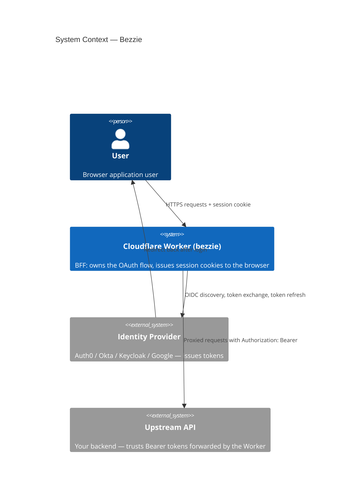
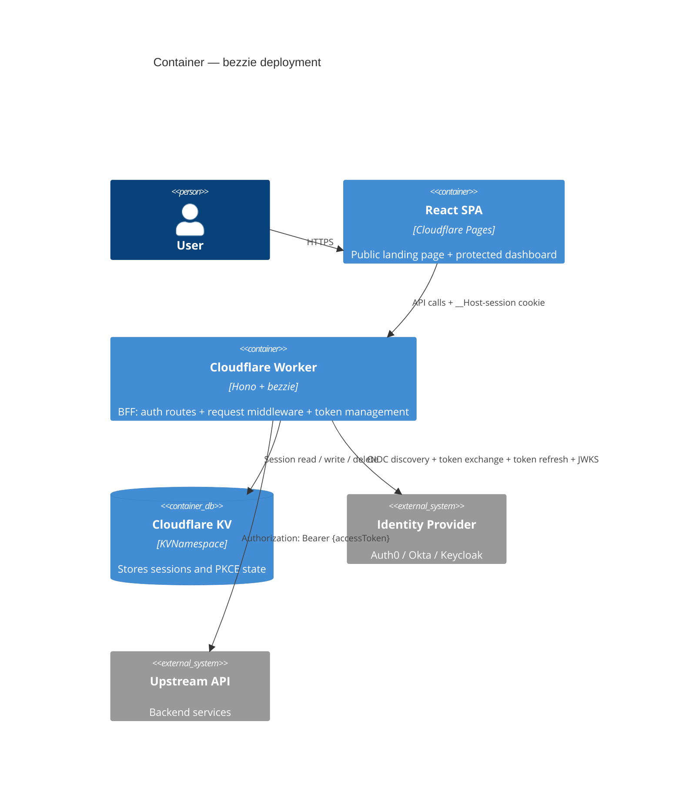

# Bezzie

**Your BFF's BFF.** OAuth for Cloudflare Workers + Hono, done the safe way.

If you followed Auth0's SPA guide, your access token lives in the browser — in memory, in a Web Worker, or in localStorage. Any script that runs on your page can reach it. That's not a criticism of Auth0; it's just the default SPA pattern, and it's the one [BCP 212](https://datatracker.ietf.org/doc/html/draft-ietf-oauth-browser-based-apps) now recommends against.

Bezzie moves the OAuth flow into your Cloudflare Worker. Tokens stay server-side in KV. The browser gets an `HttpOnly; Secure; SameSite=Lax` session cookie — unreadable by JavaScript, unavailable to XSS. Your frontend code gets simpler, not more complicated.

```typescript
app.route('/auth', auth.routes())       // login, callback, logout
app.use('/api/*', auth.middleware())    // protect routes — user available as c.var.user
```

[](https://www.npmjs.com/package/bezzie)
[](https://www.npmjs.com/package/bezzie)
[](https://github.com/neilpmas/bezzie/blob/main/LICENSE)
[](https://github.com/neilpmas/bezzie)

---

## Get started in 5 minutes

**1. Install:**
```sh
npm install bezzie
```

**2. Add a KV namespace to `wrangler.toml`:**
```toml
[[kv_namespaces]]
binding = "SESSION_KV"
id = "<your-kv-namespace-id>"
```

**3. Add your client secret:**
```sh
wrangler secret put AUTH0_CLIENT_SECRET
```

**4. Wire it up:**
```typescript
import { createBezzie, providers, cloudflareKVAdapter } from 'bezzie'

const auth = createBezzie({
  ...providers.auth0('your-tenant.auth0.com'),
  clientId: 'xxx',
  clientSecret: env.AUTH0_CLIENT_SECRET,
  adapter: cloudflareKVAdapter(env.SESSION_KV),
  baseUrl: 'https://app.yourproject.com',
})

app.route('/auth', auth.routes())
app.use('/api/*', auth.middleware())
```

**5. Protect a route:**
```typescript
app.get('/api/me', (c) => c.json(c.var.user))
```

Done. Your app now has BCP212-compliant BFF auth.

---

## Demo

See the full BFF flow in action: [bezzie-demo.neilmason.dev](https://bezzie-demo.neilmason.dev)

Source: [github.com/neilpmas/bezzie-demo](https://github.com/neilpmas/bezzie-demo)

---

## Why

There's no open source library for this specific combination (BFF OAuth on Cloudflare Workers). The closest alternatives are Duende BFF (.NET) and `@auth0/nextjs-auth0` — both tied to specific frameworks and neither running at the edge.

Bezzie is framework-agnostic, Workers-native, and ships with adapters for Cloudflare KV, Redis (including Upstash), and in-memory storage.

---

## Usage

```typescript
import { createBezzie, providers, cloudflareKVAdapter } from 'bezzie'

const auth = createBezzie({
  ...providers.auth0('your-tenant.auth0.com'),
  clientId: 'xxx',
  clientSecret: env.AUTH0_CLIENT_SECRET,
  audience: 'https://api.yourproject.com',
  adapter: cloudflareKVAdapter(env.SESSION_KV),
  baseUrl: 'https://app.yourproject.com',
})

// Mount auth routes
app.route('/auth', auth.routes())

// Protect API routes
app.use('/api/*', auth.middleware())
```

This gives you:

| Route | Description |
|---|---|
| `GET /auth/login` | Redirects to provider, initiates Authorization Code + PKCE flow. Supports `?returnTo=/path` query param for post-login redirect; falls back to `defaultReturnTo` (default `/`). |
| `GET /auth/callback` | Exchanges code for tokens, stores session in KV, sets cookie. |
| `POST /auth/logout` | Clears session, clears cookie, redirects to provider logout. |

---

## Optional Authentication

Use `auth.optionalMiddleware()` for public pages that should show user state when logged in but not block anonymous visitors. It populates `c.var.user` and `c.var.accessToken` if a valid session exists and always calls `next()`.

```typescript
app.use('/*', auth.optionalMiddleware())
```

---

## Accessing User Identity

After `auth.middleware()` (or `auth.optionalMiddleware()` when a session exists), downstream handlers can access the user identity and the current access token via `c.var`:

```typescript
app.get('/api/me', (c) => {
  const user = c.var.user
  const token = c.var.accessToken
  return c.json({ user })
})
```

## Forwarding Upstream

The `accessToken` on the context is intended for the app to forward to an upstream service (e.g., a Spring Boot API or any other microservice), since Bezzie doesn't mutate request headers directly.

```typescript
app.all('/api/proxy/*', async (c) => {
  const url = new URL(c.req.url)
  const target = `https://api.upstream.com${url.pathname}${url.search}`
  
  return fetch(target, {
    method: c.req.method,
    headers: {
      ...c.req.header(),
      'Authorization': `Bearer ${c.var.accessToken}`
    },
    body: c.req.raw.body
  })
})
```

---

## How It Works

### System context


```mermaid
C4Context
  title System Context — Bezzie

  Person(user, "User", "Browser application user")
  System(bezzie, "Cloudflare Worker (bezzie)", "BFF: owns the OAuth flow, issues session cookies to the browser")
  System_Ext(idp, "Identity Provider", "Auth0 / Okta / Keycloak / Google — issues tokens")
  System_Ext(upstream, "Upstream API", "Your backend — trusts Bearer tokens forwarded by the Worker")

  Rel(user, bezzie, "HTTPS requests + session cookie")
  Rel(bezzie, idp, "OIDC discovery, token exchange, token refresh")
  Rel(bezzie, upstream, "Proxied requests with Authorization: Bearer")
  Rel(idp, user, "Redirect back after login")
```

### Containers


```mermaid
C4Container
  title Container — bezzie deployment

  Person(user, "User")
  Container(spa, "React SPA", "Cloudflare Pages", "Public landing page + protected dashboard")
  Container(worker, "Cloudflare Worker", "Hono + bezzie", "BFF: auth routes + request middleware + token management")
  ContainerDb(kv, "Cloudflare KV", "KVNamespace", "Stores sessions and PKCE state")
  System_Ext(idp, "Identity Provider", "Auth0 / Okta / Keycloak")
  System_Ext(upstream, "Upstream API", "Backend services")

  Rel(user, spa, "HTTPS")
  Rel(spa, worker, "API calls + __Host-session cookie")
  Rel(worker, kv, "Session read / write / delete")
  Rel(worker, idp, "OIDC discovery + token exchange + token refresh + JWKS")
  Rel(worker, upstream, "Authorization: Bearer {accessToken}")
```

### Per-request flow

1. Browser sends request to BFF with session cookie
2. BFF looks up session in KV, retrieves access token
3. BFF validates JWT (via JWKS, using Web Crypto API)
4. If expired, BFF uses refresh token to get a new one and updates KV
5. BFF forwards request upstream with `Authorization: Bearer <token>`

---

## Adapters

Bezzie supports multiple session storage backends:

### Cloudflare KV
Recommended for production on Cloudflare Workers.
```typescript
import { cloudflareKVAdapter } from 'bezzie'
// ...
adapter: cloudflareKVAdapter(env.SESSION_KV)
```

**Write cost:** every unauthenticated `GET /login` writes one PKCE-state entry to KV. The [free tier](https://developers.cloudflare.com/kv/platform/pricing/) allows 1,000 writes/day — plan your KV usage (or upgrade tiers) with that in mind for public-facing apps. Rate limiting is on by default to bound the *burst rate* of an unauthenticated flood; it is not a hard daily cap against a sustained one — see [Security](#security) for the actual numbers and how to pair it with edge-level protection for a hard guarantee.

### Redis (Upstash)
Good for cross-region session consistency. Works with [Upstash Redis](https://upstash.com) (recommended for Cloudflare Workers) and any Redis client with `get`/`set`/`del` methods.

```typescript
import { redisAdapter } from 'bezzie'
import { Redis } from '@upstash/redis/cloudflare'

adapter: redisAdapter(new Redis({
  url: env.UPSTASH_REDIS_REST_URL,
  token: env.UPSTASH_REDIS_REST_TOKEN,
}))
```

### Memory
Useful for local development and testing. Do not use in production.
```typescript
import { MemoryAdapter } from 'bezzie'
// ...
adapter: new MemoryAdapter()
```

---

## Configuration

| Option | Type | Default | Description |
|---|---|---|---|
| `issuer` | `string` | *required* | Your OIDC provider issuer URL (e.g. `https://tenant.auth0.com`) |
| `clientId` | `string` | *required* | OAuth client ID |
| `clientSecret` | `string` | *required* | OAuth client secret — keep in Workers secrets |
| `adapter` | `SessionAdapterFactory` | *required* | Session adapter factory (e.g. `cloudflareKVAdapter(env.SESSION_KV)`) |
| `baseUrl` | `string` | *required* | Base URL of your application (used for callback and redirects) |
| `audience` | `string` | — | API audience identifier |
| `scopes` | `string[]` | `['openid', 'profile', 'email', 'offline_access']` | OAuth scopes to request. Replaces the default list entirely. |
| `routes` | `object` | `{ login: '/login', callback: '/callback', logout: '/logout' }` | Custom route paths for auth routes |
| `cookieName` | `string` | `'__Host-session'` | Name of the session cookie |
| `secureCookies` | `boolean` | `true` | When `false`, drops the `Secure` flag and `__Host-` prefix from all cookies — for plain-HTTP localhost development. Never disable in production. |
| `defaultReturnTo` | `string` | `'/'` | Post-login redirect when no `?returnTo` query param is given. Must be a relative path. |
| `sessionTtlSeconds` | `number` | `2592000` (30 days) | Session TTL in seconds |
| `refreshBufferSeconds` | `number` | `60` | Seconds before access token expiry to trigger a refresh |
| `validateAccessToken` | `boolean` | `true` | Whether to validate the access token JWT via JWKS |
| `mapClaims` | `(claims) => TUser` | — | Map raw ID token claims to your user type. Throw to abort login. |
| `providerOverrides` | `object` | — | Hard overrides for provider values (`logoutUrl`, `tokenEndpoint`) |
| `onLogin` | `(ctx) => void` | — | Called after session is created. Throw to abort login. |
| `onRefresh` | `(ctx) => void` | — | Called after token refresh. Errors routed to `onError`. |
| `onLogout` | `(ctx) => void` | — | Called after session is deleted. Errors routed to `onError`. |
| `onError` | `(err, ctx) => void` | `console.error` | Handler for non-fatal hook errors |
| `rateLimit` | `object` | `{ enabled: true, limit: 10, windowSeconds: 120, trustProxyHeaders: false }` | Flood/quota protection on `/login` and `/callback`. See [Security](#security). |

---

## Cloudflare Setup

Add a KV namespace to your `wrangler.toml`:

```toml
[[kv_namespaces]]
binding = "SESSION_KV"
id = "<your-kv-namespace-id>"
```

Add your client secret as a Workers secret:

```sh
wrangler secret put AUTH0_CLIENT_SECRET
```

---

## Security

See also [SECURITY.md](SECURITY.md) and [THREAT_MODEL.md](THREAT_MODEL.md) for the full threat model.

### Response headers

Every response from `/login`, `/callback`, and `/logout` — success and error paths alike — unconditionally carries:

```
Cache-Control: no-store
X-Content-Type-Options: nosniff
X-Frame-Options: DENY
Content-Security-Policy: frame-ancestors 'none'
```

These aren't configurable: every one of these responses carries single-use OAuth flow material or a session cookie, and none of it is ever safe to cache or frame. (Bezzie does not currently support silent-authentication-in-an-iframe flows — if that changes, frame denial on `/login` specifically may need to become configurable.)

The `Content-Security-Policy` line merges `frame-ancestors 'none'` into whatever policy your own middleware already set, rather than replacing it — if you have an app-wide CSP mounted before `auth.routes()`, it survives on these routes too. `frame-ancestors` itself is always forced to `'none'` here regardless of what you set, since that one has no config surface.

### CSP contribution helper

A consuming app that sets its own Content-Security-Policy needs to allow the OAuth redirect to the IdP — commonly `form-action`. Bezzie already knows the real endpoints from OIDC discovery, so it hands you the fragments to merge into your own policy rather than owning your CSP:

```typescript
const contributions = await auth.cspContributions()
// { 'form-action': ['https://tenant.auth0.com'], 'connect-src': [], 'frame-src': [] }

app.use('*', async (c, next) => {
  const csp = {
    'default-src': ["'self'"],
    'script-src': ["'self'"],
    ...contributions,
  }
  const header = Object.entries(csp)
    .map(([directive, sources]) => `${directive} ${sources.join(' ')}`.trim())
    .join('; ')
  c.header('Content-Security-Policy', header)
  await next()
})
```

`connect-src` and `frame-src` come back empty — in a correct BFF setup, browser-side code never talks to the IdP directly (the token exchange happens server-side, in `/callback`), so there's nothing to add there by default.

**Also set `Referrer-Policy: strict-origin-when-cross-origin`** (or stricter) on your app's own responses. Bezzie can't do this for you — it never serves your HTML — but it matters here specifically: `/callback?code=...&state=...` contains a single-use authorization code, and a loose referrer policy can leak that URL to third-party subresources loaded during the redirect.

### Rate limiting on auth routes — bounds burst rate, not brute-force protection, not a hard daily cap

Every unauthenticated `GET /login` writes to your session adapter (the PKCE state). Without any limiting, a trivial unauthenticated loop against `/login` would exhaust Cloudflare KV's free-tier 1,000 writes/day in seconds. Bezzie rate-limits `/login` and `/callback` by client IP to bound that burst, on by default:

```typescript
rateLimit: {
  enabled: true,           // default
  limit: 10,               // requests per window per IP
  windowSeconds: 120,
  trustProxyHeaders: false, // see below
}
```

**Be clear-eyed about what this does and doesn't guarantee.** At the defaults, one IP sustaining exactly the allowed rate for a full day can still drive roughly 7,200 requests — and each allowed request costs up to two adapter writes (this counter, plus the PKCE state), so up to ~14,000 writes/day from a single determined source. That's still well over a 1,000/day free-tier budget. What this bounds is a *burst* — the difference between "exhausted in seconds" and "would take a sustained, easily-detectable effort over hours." It is **not** a hard daily cap. For an actual guarantee, pair it with edge-level protection — [Cloudflare's own Rate Limiting rules](https://developers.cloudflare.com/waf/rate-limiting-rules/) bound the same traffic before it reaches your Worker at all, without touching your adapter's write quota.

It fails open — a counter-store error is logged and the request proceeds, because an auth library that can't authenticate anyone during a storage incident is a worse outage than the flood it defends against. A per-isolate in-memory counter sits in front of the adapter-backed one, so a flood hitting a single isolate is caught for free and never reaches your adapter's write quota.

**IP derivation and `trustProxyHeaders`:** `CF-Connecting-IP` is always trusted (Cloudflare's edge sets it; a client can't forge it). `X-Real-IP`/`X-Forwarded-For` are only consulted when you set `trustProxyHeaders: true` — enable that only behind a proxy you control that strips client-supplied values for those headers, since otherwise a client can set them itself to defeat the limiter entirely. When no trustworthy IP can be found, bezzie skips limiting for that request rather than grouping every such client into one shared bucket (which would otherwise cap your *entire app's* login rate globally).

**This is not credential-stuffing or brute-force protection.** With a hosted IdP (Auth0, Okta, Google, Keycloak), the actual password submission happens on the IdP's own login page — bezzie never sees it, and rate-limiting `/login` does nothing to slow a password-guessing attack against it. Brute-force defense is the IdP's job (e.g. Auth0 Attack Protection, Okta ThreatInsight).

The same limiter is exported for your own routes, keyed on the authenticated user (falling back to IP) rather than IP alone — identity-keying is materially stronger, since IP-only limits break down behind NAT/CGNAT. Each `rateLimiter()` call gets its own counter namespace, so mounting several with different limits never lets one's traffic count against another's:

```typescript
app.use('/api/*', auth.middleware())
app.use('/api/*', auth.rateLimiter({ limit: 100, windowSeconds: 60 }))
```

---

## Alternatives

| | Bezzie | Auth.js (NextAuth) | Lucia | Roll your own (oauth4webapi) |
|---|---|---|---|---|
| BFF pattern (tokens never in browser) | ✅ | ✅ (some adapters) | ❌ | You decide |
| Cloudflare Workers native | ✅ | ⚠️ Edge adapter | ⚠️ | ✅ |
| Hono integration | ✅ | ❌ | ❌ | ✅ |
| OIDC discovery | ✅ | ✅ | ❌ | ✅ |
| Token refresh | ✅ | ✅ | Manual | Manual |
| Pluggable session storage | ✅ (KV, Redis, Memory) | ✅ | ✅ | Manual |
| Zero Node.js deps | ✅ | ❌ | ✅ | ✅ |

---

## Stack

| Component | Choice |
|---|---|
| Runtime | Cloudflare Workers |
| Router | Hono |
| OAuth | `oauth4webapi` (spec-compliant, no Node.js deps) |
| Session storage | Cloudflare KV |

---

## Status

v1.3.0 — stable

---

## Changelog

See [CHANGELOG.md](CHANGELOG.md) for release history.

---

## License

MIT
